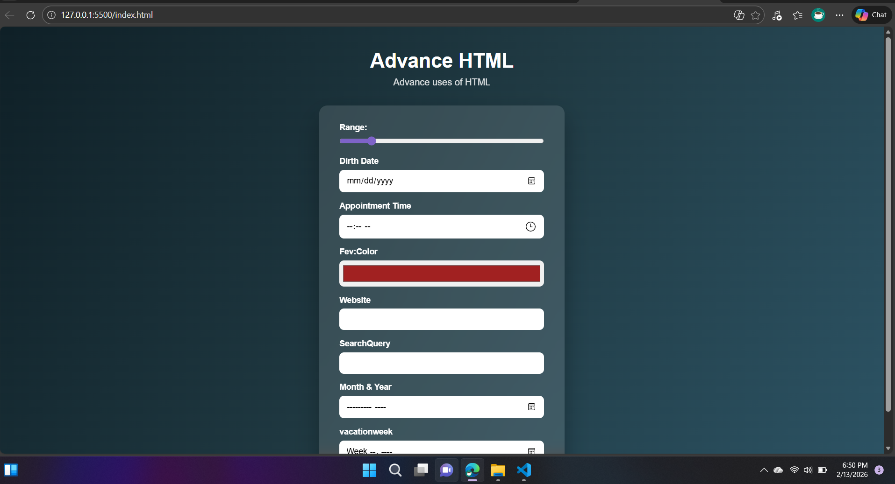

# Advanced HTML Form Inputs

This project demonstrates the advanced usage of HTML5 form input types combined with CSS styling. It is built as a frontend practice project to understand and implement modern form controls used in real-world web applications.

## 🔗 Live Demo
https://vinodkumarjaipal.github.io/html-advanced-form-inputs/

## 📌 Project Overview
The Advanced HTML Form Inputs project focuses on exploring modern HTML5 form elements that enhance user experience and improve data input accuracy. It showcases how different input types behave across browsers without using JavaScript.

## ✨ Features
- Advanced HTML5 form input elements
- Clean and structured HTML markup
- CSS used for basic styling and layout
- Responsive and browser-friendly form controls
- Practical example for frontend and software engineering students

## 🧩 HTML Input Types Used
- Range slider
- Date picker
- Time selector
- Color picker
- URL input
- Search input
- Month selector
- Week selector

## 🛠 Technologies Used
- HTML5
- CSS3

## 📸 Screenshot

## 🎯 Learning Outcomes
- Understanding advanced HTML form elements
- Improving frontend form-building skills
- Learning how modern input types enhance usability
- Strengthening HTML and CSS fundamentals

## 👨‍💻 About the Developer
I am a Full Stack Software Engineering student with strong knowledge of HTML, CSS, and frontend development.  
This project was created as part of hands-on practice to improve my understanding of advanced HTML features and modern web standards.

## 📄 License
This project is open-source and available for learning and educational purposes.
